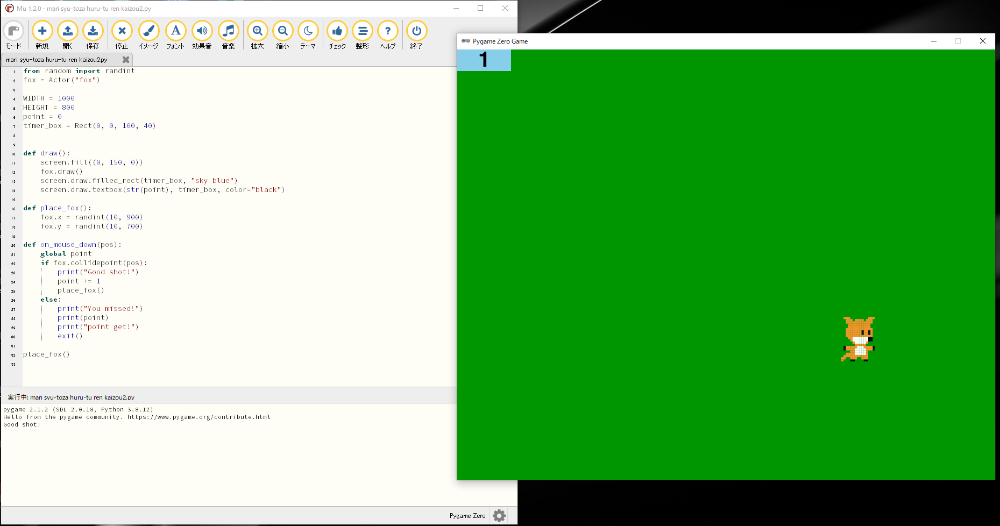
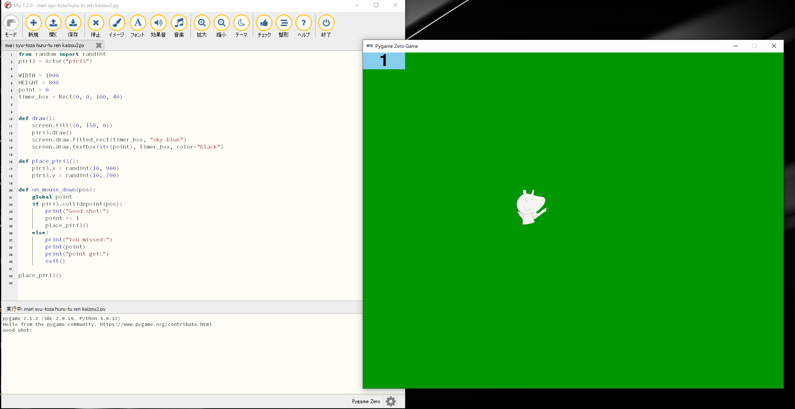
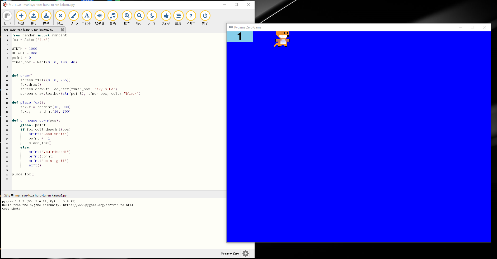
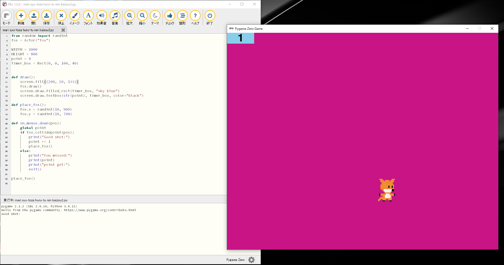

# Pythonでクリックゲーム

## パイソンとは

パイソンはアプリを作たっりするために作られた、プログラミング言語です。

#### 家にある本のプログラムを書いて、少し改造してみました。

## 〈プログラム〉

```
from random import randint
fox = Actor("fox")

WIDTH = 1000 # 画面のサイズ
HEIGHT = 800 # 画面のサイズ
point = 0
timer_box = Rect(0, 0, 100, 40) # 背景の色


def draw():
    screen.fill((200, 20, 133))
    fox.draw()
    screen.draw.filled_rect(timer_box, "sky blue") # 箱の色をみずいろにする
    screen.draw.textbox(str(point), timer_box, color="black") # ポイントの数字の色を黒にする

def place_fox():
    fox.x = randint(10, 900) # ランダムの範囲
    fox.y = randint(10, 700) # ランダムの範囲

def on_mouse_down(pos):
    global point
    if fox.collidepoint(pos):
        print("Good shot!")
        point += 1 # ポイントを1ふやす
        place_fox()
    else:
        print("You missed!")
        print(point)
        print("point get!")
        exit()

place_fox()
```

## 〈キャラクター〉

こんなキャラクターです
|  |  |  |
|----------------|--------------|----------------|
| ①りんご         | ②きつね       | ③ピリちゃん（妹が作ったキャラクター）     |

### 結果

### ②きつね



#### きつねになった！

### ③ピリちゃん



#### ピリちゃんになった！

## 〈背景色〉

### 青色



#### 青色になった！

### ピンク色



#### ピンク色になった！